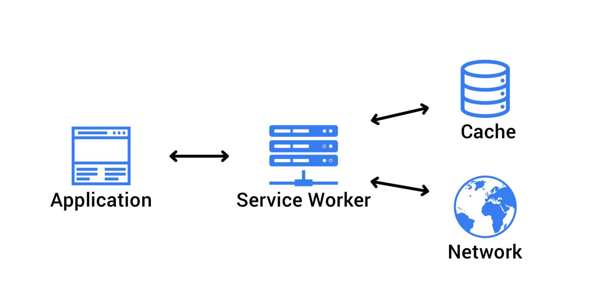

# Overview

The point of testing is to tell us when our code breaks so that we can make
changes to our code confidently. Many are familiar with the testing pyramid.


The idea is that as you go up the testing pyramid you are getting tests that
more closely resemble how a user uses your software but are more difficult and
costly to maintain so you should write mostly unit tests less integration tests
and even less end-to-end tests. A quick google search will show that this
concept was introduced by Martin Fowler at least
[8 years ago](https://martinfowler.com/bliki/TestPyramid.html). Testing tooling
has come a long way since 2012. A while back Guillermo Rauch creator of next.js
and socket.io and Kent C. Dodds the great mind behind
[testing library](https://testing-library.com/) and tons of other stuff
challenged this idea with this tweet:

https://twitter.com/rauchg/status/807626710350839808

Since 2012 our tooling has gotten much better allowing us to switch the testing
pyramid in favor of the much improved testing trophy which puts its emphasis on
integration testing rather than unit testing.


If you are currently using the testing pyramid approach Kent C. Dodds has some
advice on how you can start switching that to focus on integration tests.

> I think the biggest thing you can do to write more integration tests is to
> stop mocking so much stuff. When you mock something you’re removing all
> confidence in the integration between what you’re testing and what’s being
> mocked.

With that advice the question becomes how little mocking can we do? As it turns
out we can actually not do any Mocking!! 😱

# Mocking

_Note: I'm going to use [React](https://reactjs.org/) for all our code
examples._

I usually see mocking happen at two different levels.

1. Mock a module, function, or a
   [React hook](https://reactjs.org/docs/hooks-intro.html) that makes a rest or
   graphql call

For example lets say we have some module that calls an api and gets a user back.

```javascript
// src/services/user.ts

export function getUser(userId) {
  return fetch(`/api/user/${userId}`).then(res => {
    if (res.ok) {
      return res.json()
    }
  })
}
```

We would mock that like this:

```javascript
// src/services/__mocks__/user.ts

export function getUser(userId) {
  return Promise.resolve({
    data: {
      // user properties
    },
  })
}
```

Using this code we wouldn't be calling our actual `getUser` function in our
tests but instead replace it with our mocked `getUser` which means all of our
code inside of the real `getUser` that we might add is not tested.

2. Mock fetch or axios directly

mocking fetch or axios is slightly better because we are mocking less code which
means we are testing more code. But we still are mocking any fetch calls with
this approach so there are pieces of our code base that we aren't calling the
way a user would. This can lead to bugs that can be missed. For example using
the same example as before but switching out the level we are mocking we would
now be calling `getUser` which would catch anything we might be doing inside
that function. But imagine we had the following bug:

```javascript
export function updateUser(userId) {
  return fetch(`/api/user/${userId}`, {method: ''}).then(res => {
    if (res.ok) {
      return res.json()
    }
  })
}
```

here we wanted to do a post request but instead of using `POST` as the method we
used an empty string. This would result in a type error at runtime but because
fetch is being substituted out with a mocked implementation we dont catch that.

To catch this we'd have to stop mocking altogether. The
[msw library](https://www.npmjs.com/package/msw) makes this possible.

# MSW

[msw](https://mswjs.io/) is a library that uses service workers to intercept any
requests you make and return a mocked response. Service worker sit in the middle
between the browser and your server like so:



In other words you are actually making a request to a server and the service
worker is sending back a mocked response without the request ever hitting your
actual server. This allows us to test our software in the same way that a user
uses your software! 🎉

## How to use MSW

### Add Fetch to Your Testing Environment

Because all testing frameworks run in a node environment and node doesn't have a
native fetch implementation if you are using fetch to make requests you will
need to add a fetch implementation to your testing enviornment. For these
examples I will be using [jest](https://jestjs.io/en/).

To do this you could add a polyfill like
[whatwg-fetch](https://www.npmjs.com/package/whatwg-fetch) and add that to a
server setup file and then import your server setup file into a jest setup file.

```javascript
// setup-server.ts

import 'whatwg-fetch'
```

```javascript
// jest-setup.ts

import './setup-server'
```

The other approach that works just as well is to set global fetch to a fetch
implementation for node like unfetch directly in a jest setup file.

```javascript
// jest-setup.ts

import unfetch from 'unfetch'

global.fetch = unfetch
```

### setup your server

Once you have fetch added to your testing environment you are ready to setup
your mock server. MSW exposes a `setupServer` function will take a list of
endpoints.

```javascript
// setup-server.ts

import {setupServer} from 'msw'

setupServer()
```

### Add REST Endpoints

We are now ready to add some endpoints to our server. To do this msw exposes a
`rest` object that uses an express-like syntax. If we wanted to setup a handler
for GET requests to `/api/user` we could do that like so:

_NOTE: because we are in a node environment we pull `rest` out of `msw/node`_

```javascript
// setup-server.ts

import {setupServer} from 'msw'
import {rest} from 'msw/node'

setupServer(rest.get('/api/user', requestHandler))
```

now anytime a GET request is made to an endpoint matching `/api/user` the
service worker will intercept that request. We can add as many of these as we
need to in order to handle all of our requests. If we needed to handle mutations
we would add similar handlers.

```javascript
// setup-server.ts

import {setupServer} from 'msw'
import {rest} from 'msw/node'

setupServer(
  rest.get('/api/user', requestHandler),
  rest.post('/api/user', requestHandler),
  rest.put('/api/user', requestHandler),
)
```

### Add GraphQL Queries and Mutations

MSW can also handle GraphQL queries and mutations. We just need to use the
graphql object and use the query and mutation methods to suit our needs.

```javascript
// setup-server.ts

import {setupServer} from 'msw'
import {rest, graphql} from 'msw/node'

const server = setupServer(
  rest.get('/api/user', requestHandler),
  rest.post('/api/user', requestHandler),
  rest.put('/api/user', requestHandler),
  graphql.query('getUser', requestHandler)
  graphql.mutation('updateUser', requestHandler)
)
```

One thing to note here is that because MSW matches based on query and mutation
name you have to make sure that the query or mutation is named which is
absolutely necessary in graphQL.

### Handling Requests

The only thing left to do to setup our server is to handle our requests. MSW
request handlers are functions that has 3 parameters

- the incoming request
- the response to send back
- and context that has helper methods to help you build up the response.

Typically you'll be using the `ctx.data` method for graphQL calls and the
`ctx.json` method for REST calls.

```javascript
function requestHandlerRest(req, res, ctx) {
  return res(
    ctx.json({
      // the data you want to send back
    }),
  )
}

function requestHandlerRest(req, res, ctx) {
  return res(
    ctx.data({
      // the data you want to send back
    }),
  )
}
```

There are many more helpers you can use to learn about those check out their
[documentation](https://mswjs.io/docs/).

### Starting Your Server

In order to have your requests handled you have to start your server and close
the server when you are done also clearing handlers is a good idea between
tests. This can be done using before and after hooks.

```javascript
// setup-server.ts

import {setupServer} from 'msw'
import {rest, graphql} from 'msw/node'

const server = setupServer(
  rest.get('/api/user', requestHandler),
  rest.post('/api/user', requestHandler),
  rest.put('/api/user', requestHandler),
  graphql.query('getUser', requestHandler)
  graphql.mutation('updateUser', requestHandler)
)

beforeAll(() => server.listen())
afterAll(() => server.close())
afterEach(() => server.resetHandlers())
```

### Overrides

Setting up global mock data is nice but sometimes you need to alter your request
so you can test you've handled failure cases correctly for example. Thankfully
this is also easy to do with msw! By using the `use` method you can override any
global mocks.

```javascript
// src/__test__/file.test.ts
import {server, rest} from '../setup-server';
test('some test', () => {
  server.use(rest.get('/api/user', (req, res, ctx) => {
    return res(
      ctx.status(500);
    )
  }))

  ...

})
```

This will add a new request handler at the top of the list of handlers so that
as a request comes in it will hit your new custom request handler before the
global handler.

# Conclusion

The less we mock in our tests the more similarly our test resembles the way our
users use our software. By using msw we can actually not mock at all! This gives
us more confidence about our code helping us ship less bugs. Enjoy!!
